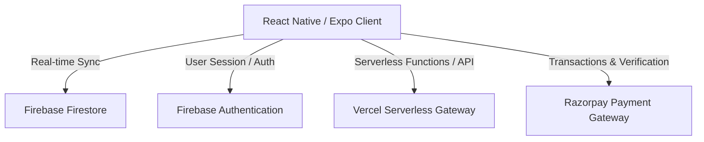

# Meat Up — Comprehensive Features, Business Logic & Implementation Report

This report documents the features, formulas, user flows, logistics logic, and technical design built into the **Meat Up** application.

---

## 1. System Architecture Overview

The system runs on a decoupled React Native / Expo application that integrates with serverless cloud services and payment APIs:



- **Frontend**: React Native + Expo (utilizing Expo Router for routing, Lucide React Native for vector icons).
- **Backend & Database**: Firebase Authentication (session tokens) and Cloud Firestore (real-time data listener).
- **Payments**: Razorpay SDK (native mobile) and Razorpay Web Script (web wrapper).

---

## 2. Authentication & Profile Management
- **Firebase Auth Integration**: Secure email/password login and registration flows.
- **Firestore User Schema**: Creates a document at `/users/{uid}` storing:
  - `name`: Full Name.
  - `email`: Login Email.
  - `phone`: Mobile Contact.
  - `address`: Saved delivery address.
  - `wallet_points`: Loyalty/wallet points balance (starts at 0, credits/deducts dynamically).
  - `is_first_order_completed`: Boolean flag controlling welcome discount qualifications.
- **Session Persistence**: React Native Async Storage retains login status automatically.

---

## 3. Product Catalog & Advanced Filtering

### A. Live Market Price Ticker
- **Dynamic Trending**: Auto-scrolling horizontal marquee showcasing the top 5 trending products.
- **Price Indicators**:
  - Displays current price per unit.
  - Directional icons and color-coding: green `TrendingUp` arrow for price increases, red `TrendingDown` arrow for decreases, and neutral states.
  - Shows exact percentage fluctuation: `Math.abs(price_change_percentage)%`.

### B. Catalog Sorting & Filtering Controls
- **Search Query**: Real-time name matching (case-insensitive substring filter).
- **Category Chips**:
  - Horizontal selection chips (`All`, `Farm Goat`, `Beef`, `Halal Chicken`, etc.).
  - Compiled dynamically via:
    ```typescript
    const categories = ['All', ...new Set(products.map(p => p.category).filter(Boolean))];
    ```
- **"In Stock" Filter Toggle**:
  - Instantly filters out unavailable items.
  - Checks compatibility with the current day of the week using `isProductAvailableToday(product)`.
- **Advanced Sorting Options**:
  - **Default Sort**: Grouping available items first, then sorting by `display_order` index defined in the database (out-of-stock items are pushed to the end).
  - **Price Low-to-High (Price ↑)**: Sorts items by `current_price` ascending.
  - **Price High-to-Low (Price ↓)**: Sorts items by `current_price` descending.

---

## 4. Product Customization & Cart State

### A. Weight & Pack Sizing
- **Unit Customization**:
  - standard meat products use kilograms (KG) or grams (G) with chips for selection: `[0.5kg, 1kg, 2kg]` or `[250g, 500g, 1000g]`.
  - egg products use packs with pieces: `[6, 12, 30]`.
- **Price Multiplier**: Price calculation adjusts for selection: `price * weight_or_pack_multiplier`.

### B. Cutting Modal & Variation Selector
- Opens a sliding sheet modal (`CuttingModal`) if a product has variations or preparation requirements.
- **Cutting Options**: Custom styling selection (e.g. Skinless, Bone-In, Curry Cut, Biryani Cut) with zero base price change.
- **Product Variants**: Custom variants with unique pricing structures (e.g., White Egg vs Brown Egg).

### C. Floating Cart Banner
- Sticky banner at the bottom of the feed showing total items and total price: `₹{cartTotal}`.
- Single tap navigates to `/cart`.

---

## 5. Checkout, Location & Logistics Mechanics

### A. Real-Time Geocoding & Distance Calculation
- **Haversine Distance**: Calculates straight-line distance between the user and the retail store coordinates:
  $$\text{Distance} = 2 R \cdot \arcsin\left(\sqrt{\sin^2\left(\frac{\Delta\phi}{2}\right) + \cos(\phi_1)\cos(\phi_2)\sin^2\left(\frac{\Delta\lambda}{2}\right)}\right)$$
- **Address Geocoding Hierarchy**:
  1. Parse address for a 6-digit pin code and query location coords first.
  2. Fallback to geocoding the full address string.
  3. Secondary fallback to geocoding the last three split tokens (city, state, region).
- **Logistics Restrictions**: Maximum delivery range is capped at **20 km**. If the distance exceeds 20 km, delivery is blocked.

### B. Delivery Charges & Estimate Scheduler
- **Delivery Charge Formula**:
  - Free delivery applies for distances up to **7 km**.
  - Beyond 7 km, charge is calculated as:
    $$\text{Delivery Charge} = \lceil (\text{Distance} - 7\text{ km}) \times ₹5 \rceil$$
- **Delivery Slot Scheduler**:
  - Computes approximate delivery time in minutes based on distance:
    $$\text{Delivery Time (mins)} = \text{base\_time} + (\text{Distance} \times \text{multiplier})$$
  - Saves the slot value in the order as: `"Within {estimated_minutes} mins"`.

---

## 6. Financial & Billing Formulas

The billing engine computes receipts using the following sequence of formulas:

1. **Subtotal**:
   $$\text{Subtotal} = \sum (\text{Price} \times \text{Quantity} \times \text{Weight\_Multiplier})$$
2. **Tax (5%)**:
   $$\text{Tax} = \text{Subtotal} \times 0.05$$
3. **First Order Discount**:
   - If user has not completed their first order (`!user.is_first_order_completed`):
     $$\text{First Order Discount} = \text{Subtotal} \times 0.10$$
   - Else: $₹0$.
4. **Maximum Wallet Points Redemption**:
   - Points are redeemed at a $1\text{ point} = ₹1$ ratio.
   - Max points that can be applied to the order:
     $$\text{Max Redemption} = \min(\text{User Wallet Balance}, \text{Subtotal} - \text{First Order Discount} + \text{Tax} + \text{Delivery Charge})$$
5. **Total Payable**:
   $$\text{Total Payable} = \text{Subtotal} + \text{Tax} + \text{Delivery Charge} - \text{First Order Discount} - \text{Wallet Deduction}$$

---

## 7. Payments & Verification Gateway

- **Cash on Delivery (COD)**: Instantly logs order to Firestore with status `pending`.
- **Online Checkout (Razorpay Integration)**:
  - **Serverless Endpoint**: Call `/api/createRazorpayOrder` (hosted via Vercel Serverless) passing the final order amount. This returns a secure Razorpay order token.
  - **Dual Gateway UI**:
    - Mobile targets run via native Razorpay SDK bridge bindings.
    - Web targets use dynamically injected script elements to construct the checkout screen inside the browser.
  - **Verification**: Verifies payments with `razorpay_payment_id` and `razorpay_signature` before writing the finalized order to Firestore.

---

## 8. Loyalty Points & Order Status Tracking

### A. Point Accumulation Formula
- Users earn loyalty points based on total weight of fresh meat delivered.
- Pack-based items (Eggs, Packs) are excluded:
  $$\text{Points Earned} = \left\lfloor \sum_{\text{non-pack items}} (\text{Weight} \times \text{Quantity}) \right\rfloor$$
- **Point Credit Trigger**: Wallet points are officially credited *only* when order status reaches `'delivered'`.
- **Catch-up Syncing**: If an order status changes to `'delivered'` but points have not been credited, a background listener (`ensurePointsCredited`) triggers catch-up addition.

### B. Order Cancellation & Point Refund
- Cancellation is permitted if the order status is `'pending'`.
- Upon cancellation, the system reads `order.wallet_used` and instantly refunds that exact amount back to `user.wallet_points` in Firestore.

---

## 9. Live Customer Support Chatbot
- **Interactive Tree Selection**: Automated bot responses based on common options:
  - `Where is my order?` ➔ Redirects user to My Orders tracking screen.
  - `Issue with items` ➔ Provides guidance on quality claims and photo submissions.
  - `Refund/Cancellation` ➔ Displays refund timelines.
  - `Payment Issue` ➔ Outlines failed transaction resolution policies.
- **Direct Dial Escalation**: "Contact Support" option triggers an immediate system call intent to the phone dialer:
  ```typescript
  Linking.openURL('tel:+918281626692');
  ```

---

## 10. Technical File Reference Map

| File Path | Component | Key Feature/Business Logic |
| :--- | :--- | :--- |
| **[index.tsx](file:///n:/meatup-web/meatup-web/app/(tabs)/index.tsx)** | Feed / Home | Search, category ScrollView, sort chips logic, dynamic ticker. |
| **[checkout.tsx](file:///n:/meatup-web/meatup-web/app/checkout.tsx)** | Checkout | Location fetching, distance checks, slot calculations, wallet redemption limits, Razorpay gateway overlay. |
| **[cart.tsx](file:///n:/meatup-web/meatup-web/app/(tabs)/cart.tsx)** | Cart | Quantity editing, subtotal additions. |
| **[[id].tsx (Product)](file:///n:/meatup-web/meatup-web/app/product/[id].tsx)** | Product Details | Descriptions, product weight parameters, reviews index. |
| **[[id].tsx (Order)](file:///n:/meatup-web/meatup-web/app/order/[id].tsx)** | Order Status | Visual status tracking bar, cancel buttons. |
| **[SupportChatModal.tsx](file:///n:/meatup-web/meatup-web/components/SupportChatModal.tsx)** | Support | Option selection pathways, telephone integration. |
| **[AppContext.tsx](file:///n:/meatup-web/meatup-web/contexts/AppContext.tsx)** | Core Logic | Cart state, points calculation formulas, placeOrder transactional writes. |
| **[OrderService.ts](file:///n:/meatup-web/meatup-web/services/OrderService.ts)** | DB Services | Points auto-crediting listener, wallet refunds on cancellation. |
| **[UserService.ts](file:///n:/meatup-web/meatup-web/services/UserService.ts)** | DB Services | Profile writes, wallet balance modifications. |
